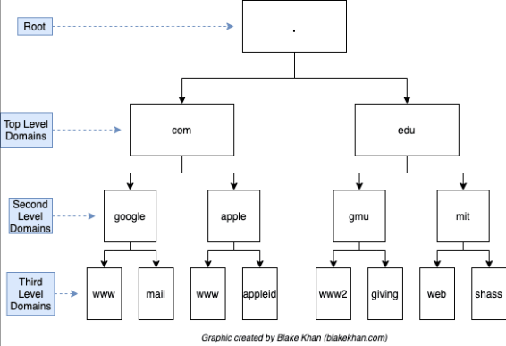

# Linux Netzwerkkonfiguration

**[OSI-Modell](https://de.wikipedia.org/wiki/OSI-Modell)**

## Grundlagen TCP/IP – OSI Layer 3

- Verbingungsloses Protokoll auf OSI Layer 3
- Zwei Versionen: IPv4 und IPv6
- IPv4 Adressen sind 32 Bit, z. B. `192.0.2.19`
- IPv6 Adressen sind 128 Bit, z. B. `2001:db8::c0:0:2:13`
- Bestimmte IPs sind für bestimmte Zwecke reserviert:
    - IPv4 in [RFC 5735](https://datatracker.ietf.org/doc/html/rfc5735)
    - IPv6 in [RFC 5156](https://datatracker.ietf.org/doc/html/rfc5156)
- [NAT](https://de.wikipedia.org/wiki/Netzwerkadress%C3%BCbersetzung) Übersetzung von IPv4 auf IPv6, durch z.B. Router <br><br>

- Adressen teilen sich in Network und Host Part mittels Subnetmask
- [CIDR](https://de.wikipedia.org/wiki/Classless_Inter-Domain_Routing) – Classless Inter-Domain Routing
- IPv4 zwei Notation: entweder 255.255.255.0 oder /24
- IPv6 kennt nur CIDR, Network Part ist maixmal /64
- Funktion des Default Gateways
    - Wenn Pakete nicht klar zugeordnet werden können, werden diese auf das "default Gateway" gesendet.<br><br>

- Siehe auch:
    - [VLAN](https://de.wikipedia.org/wiki/Virtual_Local_Area_Network) 
    - [DHCP](https://de.wikipedia.org/wiki/Dynamic_Host_Configuration_Protocol)
    - [APIPA](https://de.wikipedia.org/wiki/Zeroconf#Microsoft_APIPA) (nie richtig umgesetzt)

## Grundlagen TCP/IP – OSI Layer 4

- [TCP](https://de.wikipedia.org/wiki/Transmission_Control_Protocol) – Transmission Control Protocol (Handshake und Kommunikationsankündigung)
    - Zuverlässig
    - Verbindungorientiert
- [UDP](https://de.wikipedia.org/wiki/User_Datagram_Protocol) – User Datagram Protocol (Fire and Forget)
    - Zustandslos
    - Verbindungslos
- Beide verwenden Ports zur Identifikation des Dienstes (0 – 65535)
- [ICMP](https://de.wikipedia.org/wiki/Internet_Control_Message_Protocol) – Internet Control Message Protocol *(Wird teilweise auch Layer 3 zugeordnet)*
    - [ping(8)](https://www.man7.org/linux/man-pages/man8/ping.8.html) : ICMP ECHO_REQUEST an Host senden und ECHO_RESPONSE empfangen<br><br>


- Source IP : Source Port – Dest IP : Dest Port = Eindeutige Verbindung
- Notation von Ports immer mit Protokoll: `80/tcp` oder `53/udp`
- [getent(1)](https://man7.org/linux/man-pages/man1/getent.1.html) – Allzwecktool der Namensauflösung
    - `getent hosts` - Auflösung von Namen zu IPs und umgekehrt (/etc/hosts und DNS)
    - `getent services` - Auflösung von Protokollen zu Port Nummern und umgekehrt (/etc/services)
    - `getent passwd` - Anzeige von lokalen Benutzeraccounts (/etc/passwd)

## Hilfsmittel
- [ping(8)](https://man7.org/linux/man-pages/man8/ip.8.html) – Is there anybody out there?
- [ip(8)](https://man7.org/linux/man-pages/man8/ip.8.html) – Schweizer Taschenmesser fürs Netzwerk
    - [ifconfig(8)](https://man7.org/linux/man-pages/man8/ifconfig.8.html) hiess das früher mal
    - `ip address show`
    - `ip route show`
- [ss(8)](https://man7.org/linux/man-pages/man8/ss.8.html) – Zeigt Statistiken von Sockets an
    - [netstat(8)](https://man7.org/linux/man-pages/man8/netstat.8.html) hiess das früher mal
    - `ss -atu`
    - `ss -tulpe`

## Jeder Distro ihr eigenes Tool:
- Debian - NetworkManager
- Red Hat - NetworkManager
- SuSE - YaST
- Ubuntu - Netplan
- **Traditionelle Tools teils immer noch vorhanden:**
- [ifconfig(8)](https://www.man7.org/linux/man-pages/man8/ifconfig.8.html)
- [route(8)](https://man7.org/linux/man-pages/man8/route.8.html)

## Dateien
- **Lokale Namensauflösung**
    - `/etc/hosts` - [hosts(5)](https://www.man7.org/linux/man-pages/man5/hosts.5.html) - Hostnamen IP Adressen - *(mit DNS obsolet)*
    - `/etc/networks` - [networks(5)](https://man7.org/linux/man-pages/man5/networks.5.html) - Netzwerknamen IP Subnetze - *(historisch)*
    - `/etc/services` - [services(5)](https://man7.org/linux/man-pages/man5/services.5.html) - Dienste TCP / UDP Ports
- **Namensauflösung im Netz**
    - `/etc/resolv.conf` - [resolv.conf(5)](https://man7.org/linux/man-pages/man5/resolv.conf.5.html) - DNS Server
    - `/etc/nsswitch.conf` - [nsswitch.conf(5)](https://man7.org/linux/man-pages/man5/nsswitch.conf.5.html) - Name Service Switch
- **Netzwerkkonfiguration**
    - `/etc/netplan/*` - [netplan(5)](https://manpages.ubuntu.com/manpages/bionic/man5/netplan.5.html) - Netplan Config Files

## Von Frontends und Backends
- Netzwerk wird von [systemd-networkd(8)](https://man7.org/linux/man-pages/man8/systemd-networkd.service.8.html) gesteuert = Backend
    - Eigenes Tool namens [networkctl(1)](https://man7.org/linux/man-pages/man1/networkctl.1.html)
    - Eigene Config Files in verschiedenen Verzeichnissen
- Netzwerk wird von [netplan(5)](https://manpages.ubuntu.com/manpages/bionic/man5/netplan.5.html) konfiguriert = Frontend
- Frontend generiert die Konfiguration für das Backend

## Netplan
Konfiguration mittels YAML – Yet Another Markup Language
Ausführliche Dokumentation in [netplan(5)](https://manpages.ubuntu.com/manpages/bionic/man5/netplan.5.html) und auf https://netplan.io/
```
bruno@server:~$ sudo more /etc/netplan/50-cloud-init.yaml
# This file is generated from information provided by the datasource. Changes
# to it will not persist across an instance reboot. To disable cloud-init's
# network configuration capabilities, write a file
# /etc/cloud/cloud.cfg.d/99-disable-network-config.cfg with the following:
# network: {config: disabled}
network:
ethernets:
enp0s3:
dhcp4: true
version: 2
```
# DNS - Telefonbuch des Internets
- DNS ist in Domänen unterteilt, baumförmig angeordnet:


- DNS liefert IP-Adressen zu Hostnamen und umgekehrt
- Verschiedene Ressource Records für verschiedene Einträge:
    - A - Hostname zu IPv4 Adresse
    - AAAA - Hostname zu IPv6 Adresse
    - PTR - IP-Adresse zu Hostname
    - CNAME - Alias zu Hostname (canonical-name)
    - NS - Zuständiger Nameserver für Zone
    - MX Mail - Exchanger der Domain
    - TXT - Freitext, je nach Kontext (SPF) festes Format
    - SRV - Service, wie ein Dienst erreichbar ist
    - LOC - Location, wo sich ein Objekt befindet
    - SSHFP - SSH Hostkey Fingerprint

## Tools rund um DNS
- [host(1)](https://linux.die.net/man/1/host) - Einfache Abfrage von Einträgen
- [nslookup(1)](https://linux.die.net/man/1/nslookup) - Interaktive Abfrage von Einträgen
- [dig(1)](https://linux.die.net/man/1/dig) - Erweiterte Infos zur Abfrage von Einträgen
- [resolvectl(1)](https://www.man7.org/linux/man-pages/man1/resolvectl.1.html) - Konfiguration des Stub Resolvers [systemd-resolved(8)](https://man7.org/linux/man-pages/man8/systemd-resolved.service.8.html)

## Troubleshooting
- Überprüfen der aktuell genutzten Resolver <br>
`bruno@server:~$ resolvectl status`
- Anzeigen und leeren des lokalen Caches<br>
`bruno@server:~$ sudo resolvectl show-cache`<br>
`bruno@server:~$ sudo resolvectl flush-caches`
- Logeinträge anschauen<br>
`bruno@server:~$ sudo journalctl _SYSTEMD_UNIT=systemd-resolved.service`

# DHCP – Dynamic Host Configuration Protocol

- Nur IPv4
- Automatische Konfiguration von Netzwerkinterfaces
- Vergabe von IP-Adresse mittels Lease
- DORA:
    - DHCP**D**ISCOVER - Finde den DHCP-Server im lokalen Netzwerk
    - DHCP**O**FFER - Offeriere dem Client eine IP-Adresse
    - DHCP**R**EQUEST - Fordere die offerierte IP-Adresse an
    - DHCP**A**CK - Bestätige dem Client die angeforderte IP-Adresse
- Zuordnung von IP zu Host erfolgt:
    - Dynamisch - Host beliebige frei IP-Adresse aus dem Pool des DHCP-Servers
    - Statisch - Host erhält anhand seiner MAC-Adresse immer dieselbe IP

# IPv6 machts anders
- IPv6 hat SLAAC – Stateless Address Autoconfiguration ([RFC 4862](https://datatracker.ietf.org/doc/html/rfc4862))
- SLAAC liefert IP des Default Gateways und ev. DNS-Server ([RFC 8106](https://datatracker.ietf.org/doc/html/rfc8106))
- DHCPv6 ([RFC 3315](https://datatracker.ietf.org/doc/html/rfc3315)) liefert zusätzliche Parameter, z. B. NTP-Server

# Network Time Protocol
- Stellt sicher, dass die Uhr des Hosts stimmt
- Regelmässige Synchronisation gegen NTP-Server
- Stratum gibt Auskunft über Qualität der Zeitquelle
- Moderne Kryptographie funktioniert ohne NTP nicht (Zertifikate)
- Zuständig in der Schweiz ist [METAS](https://www.metas.ch/metas/de/home/fabe/zeit-und-frequenz/time-dissemination.html)

