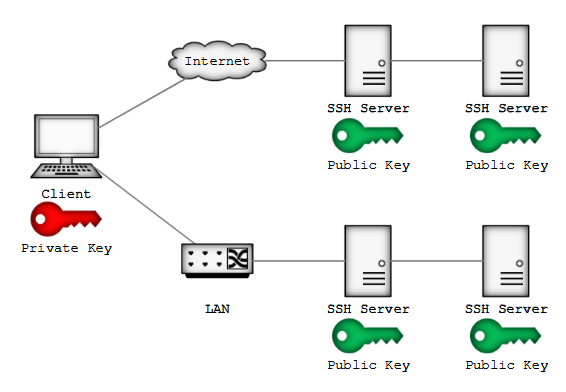

# SSH
- SSH ist unter Linux was RDP unter Windows ist
- Login auf entfernten Systemen via Netzwerk
- Verbindung ist verschlüsselt
- [OpenSSH](https://www.openssh.com/) hat die weiteste Verbreitung

## Schlüssel und Agenten
- [Asymmetrische Kryptographie](https://de.wikipedia.org/wiki/Asymmetrisches_Kryptosystem)
- Jedem Objekt seinen Schlüssel
    - Host Keys für die Systeme
    - User Keys für die Benutzer
- Private Key bleibt beim Besitzer unter Verschluss
- Public Key darf überall offen rumliegen
- SSH Agent – der zuverlässige Schlüsselbund

- Agent forwarding - Weiterleiten des SSH Agents von Jumphost zum Client  (Nie auf Jumphosts zusaetzliche private Keys erstellen)

### Host Keys
- Wo liegt der Private Key des Hosts? (Auf dem Server)
- Methoden zur Überprüfung des Host Keys:
    - Abgleich gegen `/etc/ssh/known_hosts` und `~/.ssh/known_hosts`
    - Abgleich gegen SSHFP Resource Record im DNS (DNSSEC erforderlich)

### User Keys
- Wo liegt der Private Key des Users? (Auf dem Client)
- Typen von Schlüsseln:
    - DSA Digital Signature Algorithm (veraltet)
    - ECDSA Elliptic Curve DSA (Schlüssel von 160 bit)
    - Ed25519 Elliptic Curve (Schlüssel von 512 bit)
    - RSA Rivest-Shamir-Adleman (veraltet wenn Schlüssel < 4096 bit)
- [ssh-keygen(1)](https://www.man7.org/linux/man-pages/man1/ssh-keygen.1.html) zum Verwalten von Schlüsseln
- [PuTTYgen](https://www.chiark.greenend.org.uk/~sgtatham/putty/latest.html) unter Windows

- Hinterlegen des Public Keys in `~/.ssh/authorized_keys`
- [ssh-copy-id(1)](https://man7.org/linux/man-pages/man1/ssh-copy-id.1.html) ist mit Vorsicht zu geniessen; besser manuell erledigen:
    - `bruno@server:~$ cat ~/.ssh/id_ed25519.pub | ssh bruno@install ‘cat >> .ssh/authorized_keys’`
    - `bruno@install:~$ vi .ssh/authorized_keys`
- Permissions sind entscheidend!
    - `~/.ssh` - bruno:bruno 0700  - (rwx------)
    - `~/.ssh/authorized_keys` - bruno:bruno 0600 - (rw-------)
    - `~/.ssh/id_ed25519` - bruno:bruno 0600 - (rw-------)
    - `~/.ssh/id_ed25519.pub` - bruno:bruno 0644 - (rw-r--r--)
- Testen mittels [ssh(1)](https://man7.org/linux/man-pages/man1/ssh.1.html)

## SSH Agent
- One [ssh-agent(1)](https://www.man7.org/linux/man-pages/man1/ssh-agent.1.html) to hold them all
- Mehrere Schlüssel mit gleichem Passphrase
- Agent Connections lassen sich forwarden

## SSH File Transfer Protocol SFTP
- SFTP (SSH File Transfer Protocol)
- SFTP ≠ FTPS ([RFC 4217](https://datatracker.ietf.org/doc/html/rfc4217)) ≠ SFTP ([RFC 913](https://datatracker.ietf.org/doc/html/rfc913))
- [scp(1)](https://www.man7.org/linux/man-pages/man1/scp.1.html) um einzelne Dateien zu kopieren
- [sftp(1)](https://man7.org/linux/man-pages/man1/sftp.1.html) als voller Client inkl. interaktivem Modus
- Windows Clients:
    - WinSCP
    - FileZilla
    - PuTTY
    - OpenSSH for Windows

## Server & Config
- [sshd(1)](https://man7.org/linux/man-pages/man8/sshd.8.html) ist der Server
- Systemweite Config unter `/etc/ssh/*`, siehe [sshd_config(5)](https://man7.org/linux/man-pages/man5/sshd_config.5.html)
- Individuelle Config des Clients unter `~/.ssh/config`, siehe [ssh_config(5)](https://man7.org/linux/man-pages/man5/ssh_config.5.html)