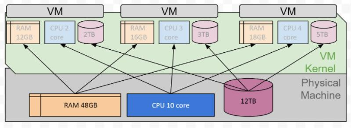
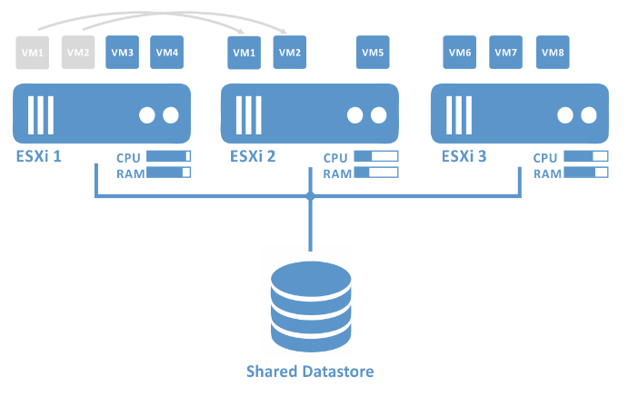
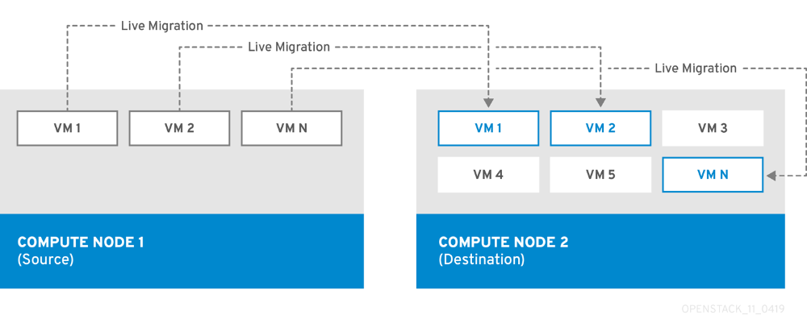
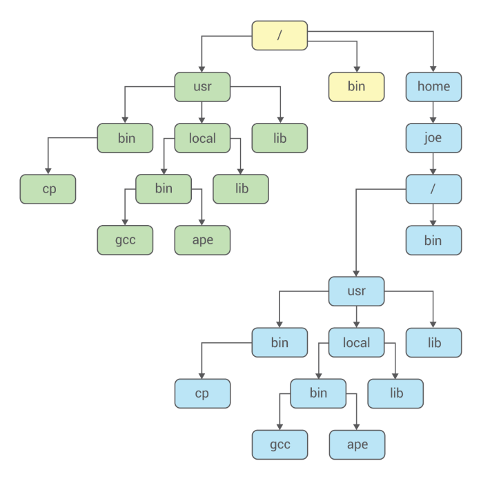
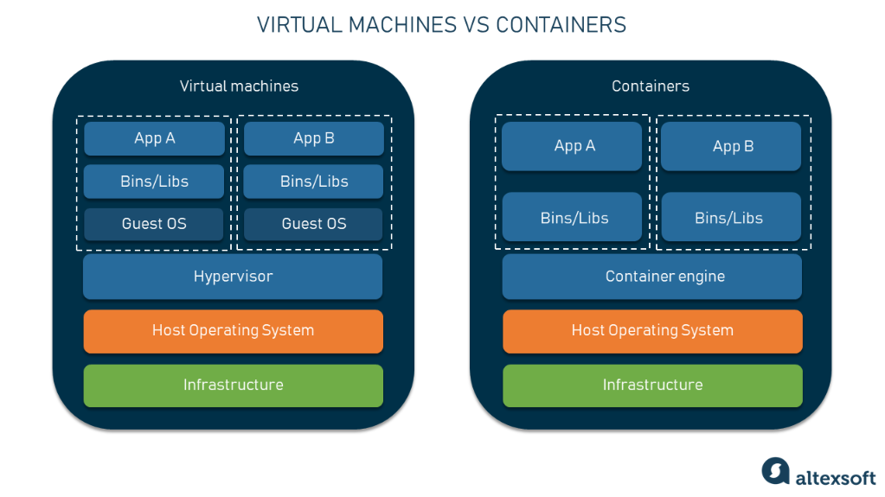

# Virtualisierung 

- Hardware ist teuer und unterbeschäftigt
- Abstraktion der Hardware zur gemeinsamen Nutzung
- Mehrere virtuelle Systeme teilen sich reale Hardware
- Aus eins mach viele

- Hypervisor steuert virtuelle Maschinen
- Hypervisor kann Teil eines normalen OS sein, z. B. Linux KVM
- Hypervisor kann eigenes OS sein, z. B. VMware ESXi
- Unterschiede verschwinden, gängige OS kommen heute mit Hypervisor:
    - Linux KVM / QEMU
    - OpenBSD vmm/vmd
    - FreeBSD bhyve
    - Microsoft Hyper-V

## Kernel-Module
- Kernel-Module erweitern den Linux-Kernel
- Die meisten Module sind Gerätetreiber
-Laden und Entfernen geschieht dynamisch durch den Kernel
- [lsmod(8)](https://www.man7.org/linux/man-pages/man8/lsmod.8.html) - zeigt geladene Module an
- [modinfo(8)](https://man7.org/linux/man-pages/man8/modinfo.8.html) - zeigt Informationen zu Modulen an
- [modprobe(8)](https://man7.org/linux/man-pages/man8/modprobe.8.html) - lädt und entfernt Module im laufenden Betrieb

## KVM / QEMU
- KVM – Kernel-based Virtual Machine ist ein Kernel-Modul
- QEMU – Quick EMUlator ist ein Softwarepaket zur Virtualisierung
- Bei gleichem Befehlssatz native Ausführung des Gastes
    - Erfordert CPU mit Befehlssatz zur Virtualisierung
- Emulation anderer Befehlssätze möglich, z. B. ARM auf x86

## Hochverfügbarkeit mit Clustern
- Fällt ein Host aus können VMs auf überlebenden neu gestartet werden
- Arbeitslast kann händisch oder automatisch mittels DRS verteilt werden

## Migration
- In Clustern lassen sich VMs beliebig im laufenden Betrieb verschieben
    - Compute Migration - VMs zwischen Hosts verschieben
    - Storage Migration - VMs zwischen Storage Volumes verschieben

## Schnappschuss
- Verschiedene Zustände von VMs mittels Snapshots speichern
- Einfaches Rollback von fehlerhaften Änderungen
- Backup-Software kann ganze VM konsistent sichern
- Technische Umsetzung:
    - Zustand der CPU und des RAMs wird in Dateien festgehalten
    - Alle schreibenden Zugriffe auf Disks werden in andere Datei umgeleitet

## Vernachlässigte Helferlein
- Wörter zählen mit [wc(1)](https://www.man7.org/linux/man-pages/man1/wc.1.html)
- Listen sortieren mit [sort(1)](https://man7.org/linux/man-pages/man1/sort.1.html)
- Spalten auswählen mit [cut(1)](https://man7.org/linux/man-pages/man1/cut.1.html)
- Tabellen bauen mit [paste(1)](https://man7.org/linux/man-pages/man1/paste.1.html)
- Zeichen ersetzen mit [tr(1)](https://man7.org/linux/man-pages/man1/tr.1.html)
- Dateien vergleichen mit [diff(1)](https://www.man7.org/linux/man-pages/man1/diff.1.html)

# Container
- Container beinhaltet:
    - Applikation
    - Konfiguration
    - Abhängigkeiten:
        - Bibliotheken
        - minimales Userland
- Frühere Ansätze dazu:
    - [chroot(1)](https://www.man7.org/linux/man-pages/man1/chroot.1.html)
    - [FreeBSD Jails](https://docs.freebsd.org/en/books/handbook/jails/)

## Exkurs chroot
- Einsperren von Prozessen
- Nur Baum unterhalb des neuen / ist erreichbar
- Gängige Praxis: Prozess sperrt sich selber ein

Wurde hauptsächlich aus Sicherheitsgründen verwendet, damit Prozesse nur Zugriff auf die nötigen Daten/Tools hat.

## Unterschied VM / Container

### Vorteile
- Ade Abhängigkeitshölle
- Schlanker als eine VM
- Schneller deployed als eine VM
- Auf Automatisierung ausgerichtet
- Startet innert Sekundenbruchteilen
- Müheloser Parallelbetrieb verschiedener Versionen

### Nachteile
- Nicht jede Software ist geeignet für Container
- Verwendung von persistentem Storage wird kompliziert
- Sicherheitslücken in Containern bleiben länger ungepatcht
- Grössere Komplexität bedroht die Sicherheit und Wartbarkeit

## Lösungen für Container
- Docker
- Rocket
- Podman 
---
- Kubernetes
- OpenShift

## Orchestrierung von Containern
- Bereitstellung, Überwachung, Skalierung
- Unzählige Container auf unzähligen Servern
- Steuerung des Clusters mittels Kubernetes
    - Pods fassen Container zusammen
    - Höhere Last = mehr Pods
    - Kleinere Last = weniger Pods
- Automatischer Neustart von ausgefallenen Containern
- Bereitstellung von persistentem Speicher für Pods